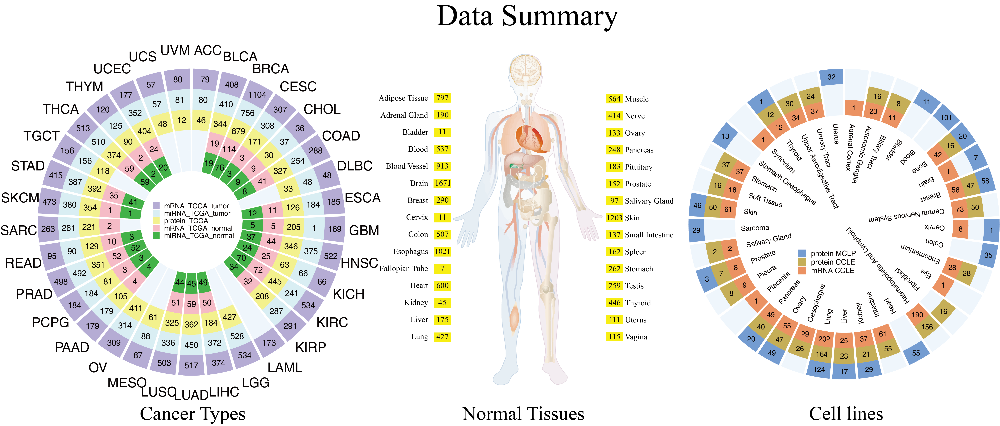

# GEDS

GEDS is an integrative gene expression platform for human cancer tissue, cancer cell line and normal tissue with mRNA level, protein level and miRNA.

On GEDS, users can input a set of names for genes, miRNAs and proteins, then click the search button, then it will show you their expressions in different cancer types, normal tissues and/or cell lines.

## Summary

mRNA level expression is quantified by RNA-seq data and consists of cancer tissue, normal tissue and cancer cell line. They are obtained from The Cancer Genome Atlas (TCGA) , Genotype-Tissue Expression (GTEx) and Cancer Cell Line Encyclopedia (CCLE) .
Protein level expression is quantified by reverse phase protein array (RPPA). It includes the cancer related ~200 protein and corresponding phosphorylated status. The data are from The Cancer Proteome Atlas (TCPA) and MD Anderson Cell Lines Project (MCLP) .
miRNA expression is collected from TCGA with tumor and normal tissue in several cancer types.

Quick search and visualization of specific gene expression in multiple cancer types or normal tissues can help researchers to focus on the certain cancer type, tissue or cell line. Then its protein level expression or phosphorylated protein expression can be examined in the cancer type or cell line. Besides, the miRNA expression can be explored to compare the tumor and normal expression. In a word, GEDS is an open access and intuitive web-based platform for searching, visualizing the mRNA, protein and miRNA expression in cancer tissue, cancer cell line and normal tissue. It is helpful for invetigator without bioinformatics skills.

## Logo

## Data set

